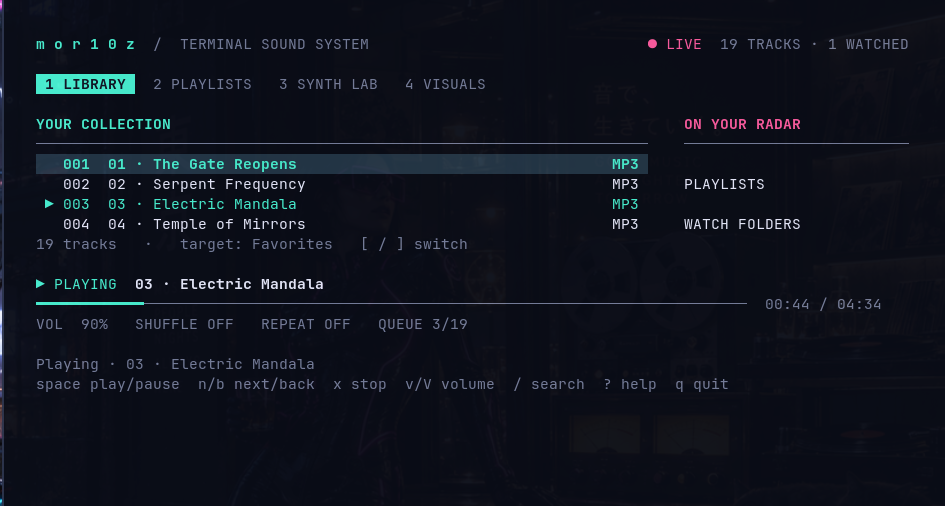
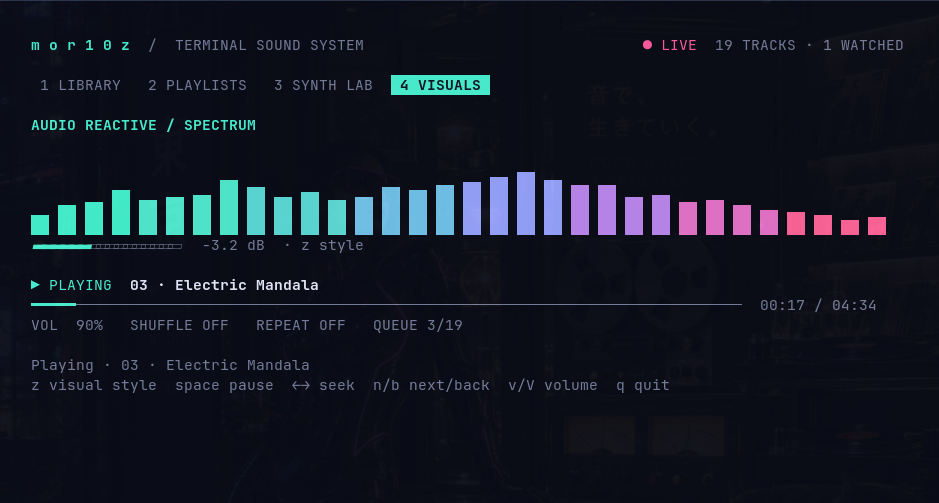

# mor10z

**Support me:** If you enjoy mor10z, [subscribe to my YouTube channel](https://www.youtube.com/@whiletrue1337). Thanks for your support!

**Terminal sound system.** A neon music player and small synth workstation written in Go.

- MP3, WAV, FLAC, OGG, M4A and Opus playback through a private mpv process.
- Play/pause, stop, next/previous, seeking, volume, mute, shuffle and repeat.
- Searchable library with recursive folder scanning every three seconds.
- Named playlists with automatic saving, M3U/M3U8 import and M3U export.
- 16-step synthesizer: saw, square, sine, triangle, suboscillator, envelope,
  low-pass filter and delay. Adjust pitch, tempo and gates; export to WAV.
- Responsive terminal interface with library, playlists and synth lab. No online services.

## Screenshots

Browse your library and control playback.



Watch the frequency spectrum while your music plays.



## Getting started

Download the Arch/Omarchy package from [releases](https://github.com/mbekkelund/mor10z/releases).
Install it with `sudo pacman -U ./mor10z-0.1.0-1-x86_64.pkg.tar.zst`.
Then open **mor10z** from the application launcher or terminal:

```bash
mor10z
mor10z ~/Music "/path/to/more tracks"
mor10z /path/to/playlist.m3u
```

Start without arguments to reopen your previous library. On first launch, mor10z
uses `~/Music` if it exists. Press `f` to add a folder from the player, or `3` and
`Enter` to hear the built-in synth sequence immediately.

Requires **mpv** on PATH and Linux/macOS with a UTF-8 terminal of at least 48 × 18.
110 × 36 or larger is recommended for the full synth panel and sidebar.
The audio engine ignores your usual mpv configuration and uses its own IPC socket
in a private temporary directory.

## Keyboard controls

| Key | Action |
| --- | --- |
| `Tab`, `Shift+Tab`, `1`–`4` | Switch panels |
| `Enter` | Play the selected track and use the displayed list as the playback queue |
| `Space` | Play/pause in the library and playlists |
| `x` | Stop |
| `n` / `b` | Next / previous (or restart the track after 3 seconds) |
| `←` / `→` | Seek 5 seconds in the library/playlists |
| `v` / `V` | Volume up / down |
| `m` | Mute |
| `s` | Toggle shuffle |
| `r` | Cycle repeat: off → track → all |
| `j` / `k`, `↓` / `↑` | Select a track |
| `PgUp` / `PgDn`, `Home` / `End` | Navigate the library |
| `/` | Search as you type; Enter leaves the search field, Esc in the list clears the search |
| `f` | Add a folder or audio file |
| `[` / `]` | Select the target playlist / switch playlists |
| `a` | Add the selected track to the target playlist |
| `P` | Create a playlist |
| `d` | Remove the selected track from the playlist (keeps the audio file) |
| `I` | Import a local M3U/M3U8 playlist |
| `e` | Export the target playlist to M3U |
| `?` | Help |
| `q`, `Ctrl+C` | Save and quit |

Controls are case-sensitive: `P`, `I` and `V` mean Shift + the corresponding key.

## Synth lab

Press `3`, then `Enter`. The synthesizer generates its own audio in Go and loops
the sequence. Synth playback replaces music playback; press `1` and Enter on a
track to return to music. This is a step sequencer, not a MIDI instrument.

| Key | Synth action |
| --- | --- |
| `←` / `→`, `h` / `l` | Select a step |
| `↑` / `↓`, `k` / `j` | Change the note by one semitone |
| `Space` | Toggle a step on/off |
| `Enter` | Apply changes and loop the sequence |
| `w` | Switch oscillators |
| `+` / `-` | Adjust tempo, 40–240 BPM |
| `,` / `.` | Lower / raise the filter cutoff frequency |
| `d` | Toggle delay |
| `[` / `]` | Transpose the entire sequence by one octave |
| `e` | Export one loop as 44.1 kHz / 16-bit mono WAV |
| `0` | Reset the pattern |
| `x` | Stop audio |

Saw and square oscillators use polyBLEP to reduce aliasing. The filter is a simple
one-pole low-pass filter. Delay is warmed up over several cycles before the loop
is exported. The oscillator drawing shows the selected waveform; it is not a
frequency analysis of the music. The synth pattern is saved on Enter and when quitting.

You can also generate the demo without mpv or the terminal interface:

```bash
mor10z --demo /tmp/mor10z-demo.wav
```

## Storage and folder scanning

Default: `$XDG_CONFIG_HOME/mor10z`, otherwise `~/.config/mor10z`.
Use `--data-dir /another/folder` for a separate profile.

- `state.json`: folders, playlists and volume; written atomically.
- `synth.json`: the latest synth pattern.
- `playlist-N.m3u`: exported playlist. Exporting the same playlist again replaces the file.
- `mor10z-synth-*.wav`: uniquely named synth exports.

Folder scanning detects new and deleted audio files, including in subfolders.
Hidden subfolders are skipped, and directory symlinks are not followed. The library
is sorted by filename; the player title comes from mpv. Large libraries may take
longer to scan, but scanning runs outside the UI thread. A playback queue is a
snapshot: newly discovered files are included when you start a new list with Enter.
Playlists retain references to moved or deleted files, and mpv reports an error
when trying to play them. M3U import supports local file paths, not streaming URLs.

## Build and test

For an installable Arch/Omarchy package, see the [packaging guide](packaging/README.md).

Requires Go 1.25+ and mpv. The Makefile also supports a local Go installation at
`../.tools/go` as a fallback when Go is not on PATH.

```bash
make build
make test
make check  # vet + race + real MP3/WAV integration with mpv --ao=null; requires ffmpeg
```

The integration test uses silent audio output and checks MP3/WAV loading, pause,
seeking, volume, stop and end-of-file. Unit tests cover file changes, playlists,
M3U, state, synth audio/WAV and terminal navigation/layout.

Built with [Bubble Tea](https://pkg.go.dev/github.com/charmbracelet/bubbletea),
[Lip Gloss](https://github.com/charmbracelet/lipgloss) and
[mpv's JSON IPC](https://mpv.io/manual/stable/#json-ipc).

## Visualizer

Press `4` while a track is playing. `z` cycles through a neon frequency spectrum,
oscilloscope and scrolling spectrogram. Space pauses; arrow keys seek.
The synth panel also displays a waveform. Start the synth with `3`, Enter, then
press `4` for the large visualizer.

Analysis uses ffmpeg to read short sections of the audio file and calculates an
FFT in Go. The display follows mpv's playback position, including seeking and
looping. It shows the source signal before volume/mute adjustments; it does not
record the microphone or other system audio. Music playback works without ffmpeg.

## License

[MIT](LICENSE). Copyright © 2026 Morten Bekkelund.
